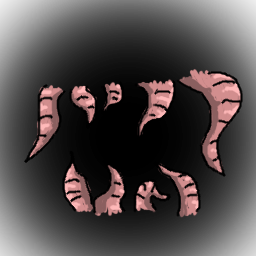
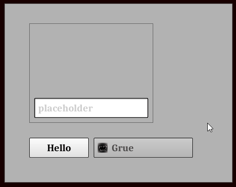
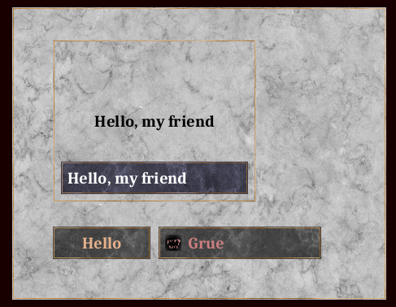

<p align="center"></p>

# Grue

Go UI lib based on [pixel](https://github.com/faiface/pixel).

While there's only pixel based implementation, API is designed
to be reasonably abstract from implementation.

This is still work in progress. Expect proper examples and tutorial
after basic functionality is implemented (v0.1.0+).

## Example video

<p align="center"></p>

## Example of textured theme

<p align="center"></p>

## Running example

```bash
go run ./cmd/example
```

## Basic functionality TODO

- [ ] Checkbutton;
- [ ] Popup menu;
- [ ] Widgets layout helper;
- [ ] Drag'n'drop;
- [ ] Charsets for fonts (currently only ASCII is supported);
- [ ] Pixel fonts (with supplied font atlas);
- [ ] More window options (fullscreen, etc).
- [ ] Using 3rd party geometry lib (or split grue/geometry to new repo);

# UI features

- [x] **Window** -- representation of underlying window. User don't have to deal with
window directly.
- [x] **Surface** -- a layer on window having custom resolution (pixel size),
providing optional bufferized draw. If pixel size is set (non-zero), the draw
is bufferized (using pixel.Canvas). There is always should be default (primary)
surface, but user can add more. Surface contains reference to window.
Window contains a list of created surfaces.
- [x] **Widget** -- an element of UI. Can be of different type: panel, pushbutton, etc.
Widgets form hierarchical structure, having parent and children.
Widget belongs to a surface;
- [x] **Theme** -- collection of parameters and functions that define how
widgets are rendered;
- [x] **Fonts** -- are loaded and rendered to atlases by pixel with simple InitTTF call;
DrawText function references font just by it's name;
- [x] Similarly, **Images** are loaded as atlases and formatted to sprites according to
configuration JSON files; they are also referenced by sprite names.
Images are to used as icons and widget backgrounds, as well, as just
drawn at surfaces.

Note: Grue currently uses same coordinate system as OpenGL: 0, 0 is at left bottom of the window.
That is different from most UI libs, which have 0, 0 at left top of the window.
